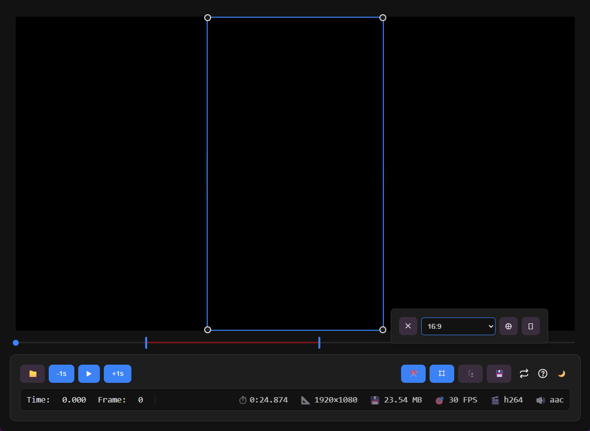
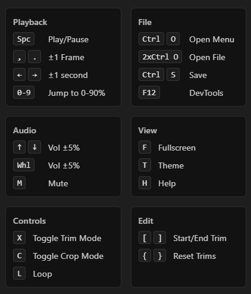

# Livideo

A simplistic video **viewer**, **editor**, and **downloader**.  
View basic Metadata or additional stream information in the DevTools' (F12) Console. 

## Current Features:  
### Video
- Trimming
- Cropping _(presets & custom)_
- Compressing _(Video/Audio/Quality options)_
### Audio (Upcoming)
- Track merge/volume/balance
- Extract
### App
- Auto updates
  - App
  - Yt-dlp
  - FFmpeg
- Loop
- YTSearch
- Keybind shortcuts
- Tab navigation friendly

## TO-DO:
- HLS (video streams)
- FFmpeg Hardware acceleration
- Dedicated binary CDN

## UI Examples:
Window | Tool Tips (H)
:-----------------------:|:-----------------------:
 | 

# Acknowledgements
- [FFmpeg](https://github.com/FFmpeg/FFmpeg)
- [yt-dlp](https://github.com/yt-dlp/yt-dlp)